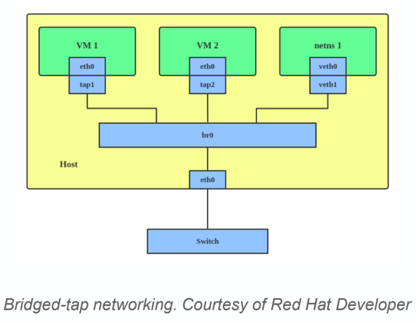

# VM Script Usage

## setup_br0.sh
Creates a bridge network linked to a network interface used for tap networking by the virtual machines.  
Usage:  
```
sudo bash setup_br0.sh --new [network device]
sudo bash setup_br0.sh --down [network device]

setup.sh options:
    -n: set up new bridge device with static IP 192.168.1.201.
    -d: take down bridge device.
```  
## ifdown.sh
Deletes tap network from the bridge (br0). It is used inside the KVM command of vm.sh.  
Usage:  
`./ifdown.sh [INTERFACE]`  

## ifup.sh
Creates tap network in the bridge (br0). It is used inside the KVM command of vm.sh.  
Usage:  
`./ifdown.sh [INTERFACE]`  

## nc-server.service
systemd service to start a netcat server used for killing (poweroff) the microVM virtual machines inside KVM.  

## vm.sh 
Starts _n_ number of virtual machines.  
Usage:  
`./vm.sh [NUM_VMS]`  
